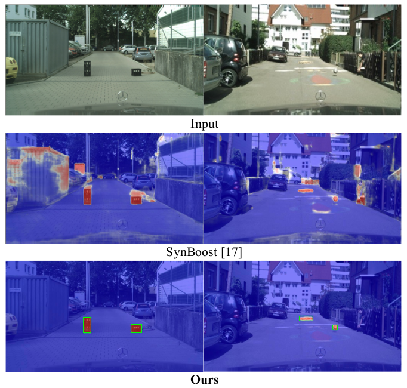
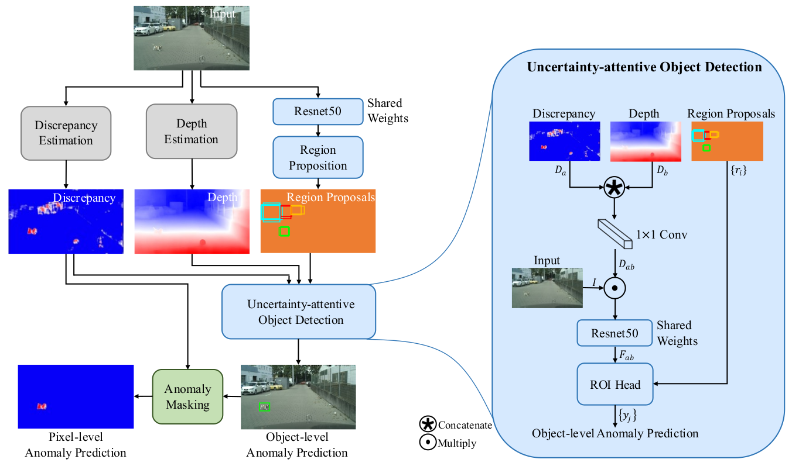
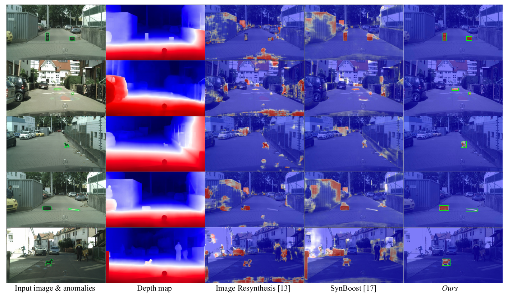

# Road Anomaly Unknown Obstacle Object Detection


### Neural Network Architecture


### Evaluation


### Citation
```
@article{IEEE_IROS_2023,
  title={Object-Level Unknown Obstacle Detection},
  author={Chuan-Yuan Huang, Cheng-Tsung Chen, Yu-An Chen, and Kuan-Wen Chen*},
  year={2023}
}
```

### Reference
- Detecting the Unexpected via Image Resynthesis, ICCV 2019
- Pixel-Wise Anomaly Detection in Complex Driving Scenes, CVPR 2021
- Boosting Monocular Depth Estimation Models to High-Resolution via Content-Adaptive Multi-Resolution Merging, CVPR 2021
